# LAI — Local AI & Android Automation Runtime

LAI is a source-only Android foundation for private, Bangla-first on-device AI and consent-driven Android automation. It targets modern arm64 Snapdragon devices, beginning with Snapdragon 8s Gen 4 (Hexagon NPU + Adreno GPU).

> **Current status:** Phase 1 foundation. The APK, Compose UI, accessibility tools, structured Shizuku wrapper, resumable Hugging Face model storage, OCR contract, and C++/JNI runtime boundary are implemented. A concrete LLM backend and Bangla OCR model are deliberately **not** claimed as working yet. See [status](docs/STATUS.md).

## Product principles

- **Local first:** prompts, screen structures, captures, and models stay on the phone.
- **Bangla first:** UTF-8 end to end, Bangla UI resources, bilingual prompts, and a versioned Bangla OCR schema.
- **User controlled:** consequential UI and Shizuku operations require confirmation.
- **No arbitrary shell:** elevated actions compile from typed, validated operations into argument arrays.
- **Source-only Git:** no SDKs, models, APKs, native libraries, caches, or keystores in the repository.
- **Documentation with code:** behavior, limitations, safety implications, and device evidence are updated in the same change.

## Phase 1 capabilities

| Area | Included now | Intentional boundary |
|---|---|---|
| Compose UX | Chat, Screen Reader, Automator, hidden Developer Mode, Bangla resources | Chat reports backend absence rather than fabricating output |
| Accessibility | Snapshot, selector, click, set text, scroll, global actions, app launch, Android 11+ screenshot | No autonomous consequential action without confirmation |
| Shizuku | Binder state, permission, UID, structured operation policy, timeout/output limits | No raw shell command API |
| Models | HTTPS Hugging Face-only download, resume, optional SHA-256, GGUF magic check, app-private registry | No model is bundled |
| Native runtime | arm64 C++20 shared library, stable JNI session API, backend registry | llama.cpp/Vulkan and QAIRT/QNN adapters are Phase 2/3 |
| Bangla OCR | Screenshot path, plugin interface, versioned structured JSON | Recognition model/runtime is a clearly reported placeholder |
| Delivery | GitHub-only SDK/NDK/CMake/Gradle setup, tests, lint, APK artifacts, tag releases | Release signing requires repository secrets |

## Architecture at a glance

```mermaid
flowchart LR
    UI[Compose UI] --> VM[MainViewModel]
    VM --> AG[AgentRuntime / tool policy]
    VM --> MR[ModelRepository]
    AG --> AX[AccessibilityGateway]
    AX --> AS[AccessibilityService]
    AG --> OCR[BanglaOcrService]
    AS --> OCR
    AG --> SH[ElevatedShell]
    SH --> SZ[Shizuku / ADB UID]
    VM --> INF[InferenceEngine]
    INF --> JNI[JNI C++ runtime]
    JNI --> CPU[llama.cpp CPU]
    JNI --> VK[Adreno Vulkan]
    JNI --> QNN[QAIRT/QNN Hexagon]
    CPU -. Phase 2 .-> JNI
    VK -. Phase 2 .-> JNI
    QNN -. Phase 3 .-> JNI
```



Detailed component, trust-boundary, thread, and data-flow diagrams are in [ARCHITECTURE.md](docs/ARCHITECTURE.md).

## Repository layout

```text
lai/
├── .github/workflows/android_build.yml  # all Android/native compilation
├── app/
│   ├── src/main/java/dev/lai/runtime/
│   │   ├── agent/                       # function calling and confirmation gate
│   │   ├── automation/                  # accessibility actions and snapshots
│   │   ├── inference/                   # model store and JNI-facing runtime
│   │   ├── ocr/                         # versioned Bangla OCR plugin boundary
│   │   ├── shell/                       # Shizuku and command allowlist
│   │   └── ui/                          # Compose product surface
│   ├── src/main/cpp/                    # C++20 backend/session interface
│   └── src/test/                        # policy and protocol unit tests
├── docs/                                # architecture and operating guides
├── gradle/libs.versions.toml            # centralized remote dependencies
└── scripts/validate_repo.sh             # 128 MB/source/docs/secret policy
```

## Remote build: fastest path

1. Open the repository on GitHub and select **Actions → Android build**.
2. Choose **Run workflow**, leave `debug`, and run it.
3. When the build finishes, download `lai-debug-<run>` from **Artifacts**.
4. Install on the Snapdragon test phone:

   ```bash
   adb install -r app-debug.apk
   ```

5. Enable **Settings → Accessibility → LAI automation** only after reviewing the description.
6. For elevated operations, install/start [Shizuku](https://shizuku.rikka.app/guide/setup/) and approve LAI.
7. Record test results using [DEVICE_TESTING.md](docs/DEVICE_TESTING.md).

No Android SDK, NDK, CMake, Gradle distribution, QNN SDK, or model is installed by the repository-generation environment.

## Release build and signing

Tagging `v0.1.0` builds and publishes an APK. Without signing secrets the workflow uses the Android debug key so the artifact is installable for testing but **not production signed**.

Configure these GitHub Actions secrets for production signing:

- `ANDROID_KEYSTORE_BASE64`
- `ANDROID_KEYSTORE_PASSWORD`
- `ANDROID_KEY_ALIAS`
- `ANDROID_KEY_PASSWORD`

See [BUILD_AND_RELEASE.md](docs/BUILD_AND_RELEASE.md) for exact commands and key-rotation cautions.

## Model download

Developer Mode accepts an HTTPS Hugging Face file URL plus an optional SHA-256. LAI downloads to `noBackupFilesDir/models`, resumes partial transfers, rejects non-GGUF content, and never requests broad storage permission. A model can be much larger than the APK/repository.

Installing a GGUF file does not make Phase 1 inference operational: a concrete backend must be linked first. Backend requirements and the Qualcomm licensing boundary are in [MODELS_AND_BACKENDS.md](docs/MODELS_AND_BACKENDS.md).

## Repository initialization (new owner/fork)

```bash
git init -b main
git add .
git commit -m "feat: scaffold LAI phase 1 runtime"
git remote add origin https://github.com/OWNER/lai.git
git push -u origin main
```

Use a credential manager or short-lived token. Never place a token in a remote URL, source file, workflow, shell script, or commit. If a token appears in chat or logs, rotate it after use.

## Documentation index

- [Architecture](docs/ARCHITECTURE.md)
- [Implementation status](docs/STATUS.md)
- [Build and release](docs/BUILD_AND_RELEASE.md)
- [Models and native backends](docs/MODELS_AND_BACKENDS.md)
- [Bangla OCR](docs/BANGLA_OCR.md)
- [Automation tool contract](docs/AUTOMATION_TOOLS.md)
- [Security and safety](docs/SECURITY_AND_SAFETY.md)
- [Physical-device testing](docs/DEVICE_TESTING.md)
- [Roadmap](docs/ROADMAP.md)
- [Contributing/documentation policy](CONTRIBUTING.md)

## License

Apache License 2.0. Third-party model weights, Qualcomm SDK components, Shizuku, and future inference engines retain their own licenses and must be reviewed independently.
