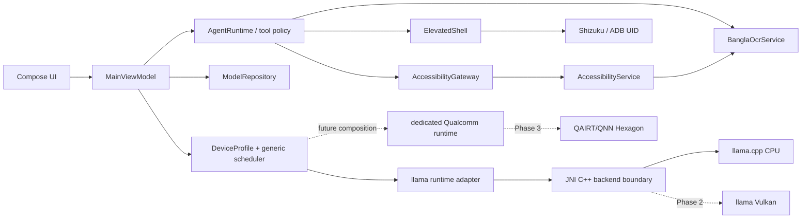

# LAI — Local AI & Android Automation Runtime

LAI is a source-only Android foundation for private, Bangla-first on-device AI and consent-driven Android automation. It targets modern arm64 Snapdragon devices, beginning with Snapdragon 8s Gen 4 (Hexagon NPU + Adreno GPU).

> **Current status:** v0.8.2 adds build-verified vendor-neutral backend contracts, opt-in one-shot local tool proposals, approval-before-execution hash-chained audit/replay protection, and privacy-safe parser outcome diagnostics for the next Qwen compliance test. Snapdragon 8s Gen 4 has physically passed reviewed Qwen installation, CPU scheduling, memory preflight, multi-turn local inference, coherent Bangla output, ~20 tok/s decode, and retained-model offline restore after uninstall. The v0.8.0 model-proposal attempt produced no valid recognized proposal, so proposal-format diagnostics/refinement, Stop/recovery, forced context trimming, and sustained thermal behavior remain gates. See [status](docs/STATUS.md).

## Product principles

- **Local first:** prompts, screen structures, captures, and models stay on the phone.
- **Bangla first:** UTF-8 end to end, Bangla UI resources, bilingual prompts, and a versioned Bangla OCR schema.
- **Snapdragon first, not locked:** optimize and physically validate Qualcomm hardware first while keeping vendor SDKs behind replaceable runtime adapters.
- **User controlled:** consequential UI and Shizuku operations require confirmation.
- **No arbitrary shell:** elevated actions compile from typed, validated operations into argument arrays.
- **Source-only Git:** no SDKs, models, APKs, native libraries, caches, or keystores in the repository.
- **Documentation with code:** behavior, limitations, safety implications, and device evidence are updated in the same change.

## One local-first application

LAI has one application ID and upgrade path. Internet is used only when the user refreshes the signed supported-model catalog or explicitly downloads a reviewed component. Installed models, verified catalog metadata and all user intelligence remain available offline. Prompts, screens, documents, generations, automation data and telemetry are never transmitted. Local file import is always available as an alternative.

## Current capabilities

| Area | Included now | Intentional boundary |
|---|---|---|
| Compose UX | Chat, Screen Reader, Automator, Settings, hidden Developer Mode, Bangla resources | Chat reports backend absence rather than fabricating output |
| Local tool proposals | Opt-in exact JSON parsing, per-tool schemas, trusted one-time review, private hash-chained audit and exact-call replay block | One validated action maximum; no autonomous chain or model-authored confirmation |
| Accessibility | Snapshot, selector, click, set text, scroll, global actions, app launch, Android 11+ screenshot | No autonomous consequential action without confirmation |
| Shizuku | Binder state, permission, UID, structured operation policy, timeout/output limits | No raw shell command API |
| Models | Signed artifact/backend/ABI metadata, explicit HTTPS download, mandatory SHA-256, resume, GGUF validation, app-private registry and Keep copy | No model is bundled; only reviewed artifact hosts are accepted |
| Native runtime | Device-validated arm64 llama.cpp CPU runtime with cancellable multi-turn streaming and metrics | Vulkan and a separately isolated QNN runtime remain Phase 2/3; no acceleration is claimed yet |
| Bangla OCR | Screenshot path, plugin interface, versioned structured JSON | Recognition model/runtime is a clearly reported placeholder |
| Delivery | GitHub-only SDK/NDK/CMake/Gradle setup, tests, lint, APK artifacts, tag releases | Release signing requires repository secrets |

## Architecture at a glance



Detailed component, trust-boundary, thread, and data-flow diagrams are in [ARCHITECTURE.md](docs/ARCHITECTURE.md).

## Repository layout

```text
lai/
├── app/                     # composition root and Compose product shell
├── core/
│   ├── contracts/           # pure tool/inference/OCR/model contracts
│   ├── policy/              # consent, shell and zero-egress decisions
│   ├── scheduler/           # evidence/thermal/memory backend routing
│   └── model/               # immutable reviewed model catalog
├── platform/
│   ├── download/            # only network permission and transport
│   ├── audit/               # private hash-chained model-tool security events
│   ├── device/              # memory/battery/thermal environment
│   ├── accessibility/       # Android Accessibility authority
│   └── shizuku/             # ADB/root UserService authority
├── runtime/
│   ├── llama/               # isolated JNI/C++ llama.cpp adapter
│   ├── ocr/                 # replaceable OCR adapter seam
│   └── orchestrator/        # policy-gated tool dispatch
├── plugins/api/             # versioned local-only plugin contract
├── docs/                    # architecture, ADRs and device evidence
└── scripts/                 # source, privacy and boundary enforcement
```

Current device-test APK: [LAI v0.8.2](https://github.com/soobujmiah/lai/releases/download/v0.8.2/app-release.apk) (temporary/debug signing).

## Remote build: fastest path

1. Open the repository on GitHub and select **Actions → Android build**.
2. Choose **Run workflow**, leave `debug`, and run it.
3. When the build finishes, download `lai-debug-<run>` from **Artifacts**.
4. Install on the Snapdragon test phone:

   ```bash
   adb install -r app-debug.apk
   ```

5. Enable **Settings → Accessibility → LAI automation** only after reviewing the description.
6. For elevated operations, install/start [Shizuku](https://shizuku.rikka.app/guide/setup/) and approve LAI.
7. Record test results using [DEVICE_TESTING.md](docs/DEVICE_TESTING.md).

No Android SDK, NDK, CMake, Gradle distribution, QNN SDK, or model is installed by the repository-generation environment.

## Release build and signing

Tagging a semantic version such as `v0.2.0` builds and publishes an APK. Without signing secrets the workflow uses the Android debug key so the artifact is installable for testing but **not production signed**.

Configure these GitHub Actions secrets for production signing:

- `ANDROID_KEYSTORE_BASE64`
- `ANDROID_KEYSTORE_PASSWORD`
- `ANDROID_KEY_ALIAS`
- `ANDROID_KEY_PASSWORD`

See [BUILD_AND_RELEASE.md](docs/BUILD_AND_RELEASE.md) for exact commands and key-rotation cautions.

## Model download

The signed web catalog provides supported models with one-tap explicit download. A verified cache and embedded fallback keep the list available offline. **Keep copy** exports an installed model through Android's document picker and re-verifies SHA-256, creating a user-owned GGUF that survives app uninstall; after reinstall, **Import file** restores it without network download. Advanced manual URLs still require a mandatory SHA-256. `platform:download` is the sole network-owning module; no prompts, screen data, generations or telemetry have an outbound path.

The v0.2 CPU backend can load a compatible GGUF after explicit user selection. Backend requirements and the Qualcomm licensing boundary are in [MODELS_AND_BACKENDS.md](docs/MODELS_AND_BACKENDS.md).

## Repository initialization (new owner/fork)

```bash
git init -b main
git add .
git commit -m "feat: scaffold LAI phase 1 runtime"
git remote add origin https://github.com/OWNER/lai.git
git push -u origin main
```

Use a credential manager or short-lived token. Never place a token in a remote URL, source file, workflow, shell script, or commit. If a token appears in chat or logs, rotate it after use.

## Documentation index

- [Current project handoff state](PROJECT_STATE.md)
- [Architecture](docs/ARCHITECTURE.md)
- [Snapdragon-first vendor backend strategy](docs/VENDOR_BACKEND_STRATEGY.md)
- [Module ownership](docs/MODULES.md)
- [NpuHub comparison](docs/ARCHITECTURE_COMPARISON_NPUHUB.md)
- [Local-first privacy invariants](docs/PRIVACY_INVARIANTS.md)
- [Implementation status](docs/STATUS.md)
- [Build and release](docs/BUILD_AND_RELEASE.md)
- [Models, per-tool configuration, Model Center, and native backends](docs/MODELS_AND_BACKENDS.md)
- [Bangla OCR](docs/BANGLA_OCR.md)
- [Automation tool contract](docs/AUTOMATION_TOOLS.md)
- [Security and safety](docs/SECURITY_AND_SAFETY.md)
- [Physical-device testing](docs/DEVICE_TESTING.md)
- [Diagnostics JSON export](docs/DIAGNOSTICS_EXPORT.md)
- [Roadmap](docs/ROADMAP.md)
- [Contributing/documentation policy](CONTRIBUTING.md)

## License

Apache License 2.0. Third-party model weights, Qualcomm SDK components, Shizuku, and future inference engines retain their own licenses and must be reviewed independently.
