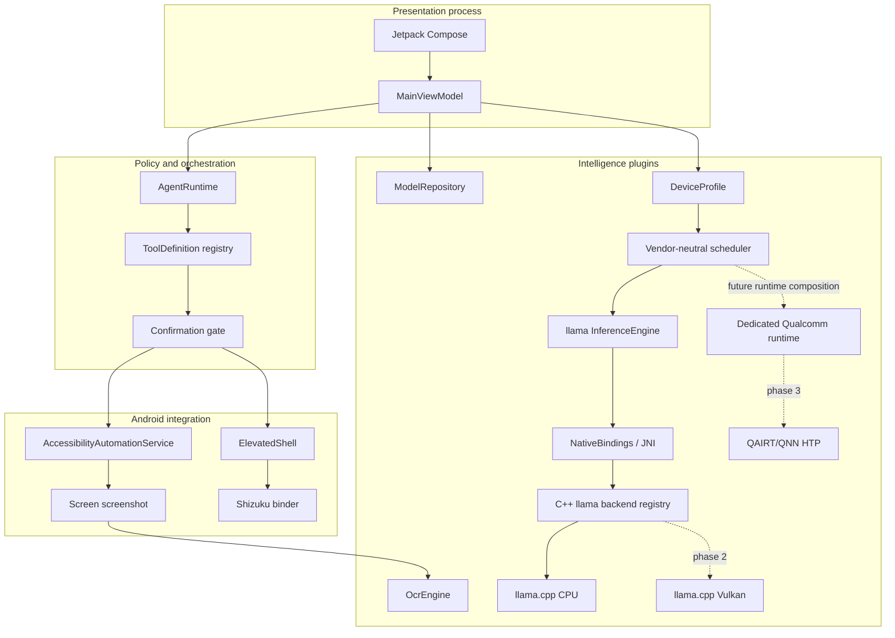
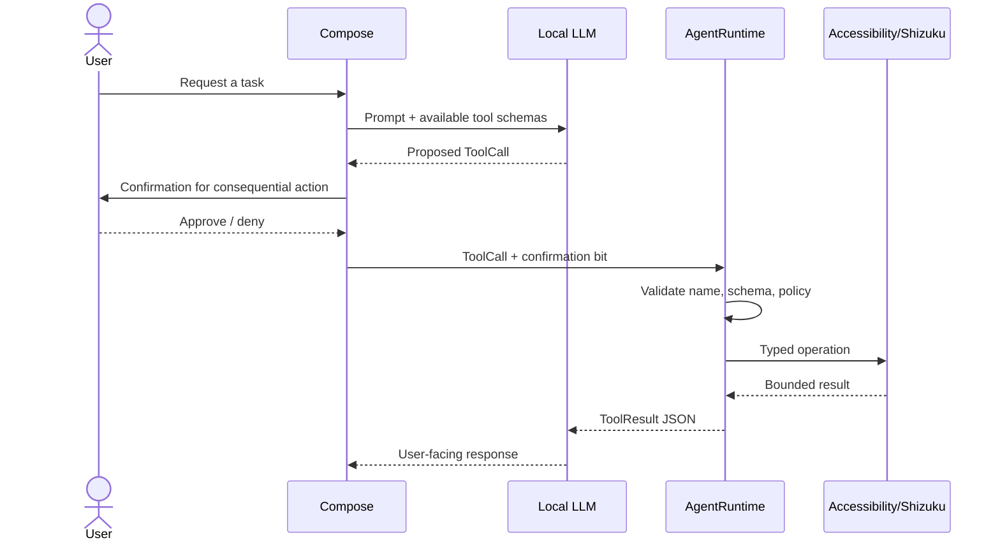

# System architecture blueprint

## 1. Scope

LAI separates product UX, agent decisions, Android control, model storage, recognition, and native inference so each can be replaced or tested without granting another component more authority. Phase labels are part of the design: unavailable adapters fail closed and are never presented as accelerated.

## 2. Compile-time module layers

The enforced graph is documented in [MODULES.md](MODULES.md). Core contracts, policy and scheduling are pure JVM; network, Accessibility and Shizuku each have one platform owner; JNI/C++ lives in runtime adapters; `app` is the composition root. See [the NpuHub comparison](ARCHITECTURE_COMPARISON_NPUHUB.md), [ADR 0002](adr/0002-modular-local-first-backbone.md), and the [Snapdragon-first decision](adr/0005-snapdragon-first-vendor-neutral-backends.md).

## 3. Runtime layers

### Presentation

`LaiApp` shows only three primary modes. Runtime details and model URL controls are behind Developer Mode. `MainViewModel` performs lifecycle-bound coroutine work and exposes immutable state.

### Agent/tool policy

The model-facing format is `ToolCall(id, name, arguments)`. `AgentRuntime` resolves only registered tools, checks confirmation, validates arguments, and returns `ToolResult`. The model never receives Java/Kotlin object references, Binder objects, accessibility nodes, or a shell.

### Accessibility

`AccessibilityAutomationService` is Android-bound and main-thread confined. `AccessibilityGateway` holds only a weak service reference. Every operation obtains a fresh active root. Snapshots are flattened to immutable, serializable nodes and bounded to 400 nodes / depth 24. Password text and descriptions are omitted.

Selectors are deterministic in this order:

1. fully qualified view resource ID;
2. hierarchy path;
3. exact visible text;
4. exact content description.

### Elevated operations

`ShizukuController` observes binder/permission state. `ShellCommandPolicy` accepts named structured operations and emits an argv list. A Shizuku `UserService` executes `ProcessBuilder(argv)` under shell/root identity; the removed/private `newProcess` API is not used. No command string is passed through `sh -c`; package names, namespaces, keys, values, and key codes are validated. Mutations require confirmation. Output is limited to 64 KiB and execution to 10 seconds by default.

### Model storage

`ModelRepository` lives in the only network-owning module and streams directly to app-private no-backup storage. It supports HTTP Range resume, mandatory SHA-256, explicit-user-action and reviewed-host policy, redirect revalidation, and GGUF magic validation. Registry replacement is write-then-rename. **Keep copy** streams to a user-selected SAF document, checks byte count and source digest, reopens the destination, and verifies its digest. The repository contains no weights. Installed models are loaded only after an explicit user tap, preventing multi-gigabyte startup allocations.

### Device profile and backend selection

`platform:device` creates a generic `DeviceProfile` from Android manufacturer/model, public SoC fields where available, API/ABI/CPU facts, memory, battery, charging, and thermal status. Runtime adapters contribute `BackendCapability` entries. Branding is diagnostic only: Snapdragon text never proves that QNN is installed or that a model is compatible.

Each adapter owns a stable opaque `BackendId` and publishes a generic `BackendDescriptor` (compute class, formats, known quantizations, and preference). Signed catalog revision 3 declares each artifact's format, context, compatible/preferred/fallback backend IDs, estimated peak memory, and required ABIs. `InferenceScheduler` knows only evidence, compatibility, resource policy, and measurements. A source boundary check rejects hardware-vendor and SDK terminology in generic inference/scheduler code. See [VENDOR_BACKEND_STRATEGY.md](VENDOR_BACKEND_STRATEGY.md) and [ADR 0005](adr/0005-snapdragon-first-vendor-neutral-backends.md).

### Native inference

The current app composes one llama `InferenceEngine`; JNI maps opaque integer handles to shared C++ `BackendSession` instances. C++ validates file existence, GGUF magic, context range, backend availability and conversation roles. The CPU runtime clears context memory per request, applies the model-native template to full user/assistant history, counts formatted tokens, evaluates bounded prompt batches, samples, and streams only complete UTF-8 code points through a cancellable callback. Oldest completed turns are omitted when prompt plus response reserve would exceed 4,096 tokens. Native monotonic clocks return prompt evaluation, TTFT, decode and total duration; metrics remain in memory and Developer Mode only.

The llama module owns `llama-cpu` and a future tested `llama-vulkan`; it contains no QNN flag, placeholder, SDK type, or model assumption. A real Qualcomm implementation will be a separately isolated runtime adapter and will be composed only when it exists. A generic backend manager is deliberately deferred until a second concrete runtime is compiled.

A production adapter must provide:

- bounded context and allocation plan;
- cancellation and token callback;
- UTF-8-safe streaming;
- backend capability probe;
- thermal/memory events;
- deterministic session destruction;
- explicit failure classification so runtime composition can choose a compatible fallback.

### OCR

Accessibility screenshot capture creates an ARGB bitmap only in memory. `BanglaOcrService` passes it to an `OcrEngine`; output uses schema version 1 with full text, blocks, BCP-47 language, confidence, polygon, and optional handwritten classification. The current placeholder returns a typed model-required error.

## 4. Control flow

The current UI exposes safe manual demonstrations; feeding tool proposals from a concrete LLM is Phase 2. The confirmation bit must originate in trusted UI state, never in model-authored JSON.

## 5. Threads and ownership

| Work | Dispatcher/thread | Owner |
|---|---|---|
| Compose/state | Main | Activity/ViewModel |
| Accessibility node operations | Main immediate | Accessibility service |
| Model catalog/policy/scheduling | caller / pure JVM | core model, policy and scheduler |
| Android memory/battery/thermal snapshot | short synchronous platform call | platform:device |
| Model network and hashing | IO | platform:download ModelRepository |
| Shizuku process streams | IO coroutines | ElevatedShell |
| OCR preprocessing/inference | Default or plugin-owned | OcrEngine |
| Native token generation | dedicated native worker (Phase 2) | BackendSession |

No accessibility node survives a command. Bitmaps are recycled after OCR. Native session handles are destroyed by `InferenceEngine.close()`.

## 6. Trust boundaries

1. **Untrusted model output:** tool names and arguments require strict parsing.
2. **Untrusted visible UI:** screen text can contain prompt injection; it is data, not authority.
3. **Accessibility authority:** can affect other apps; disabled by default and user-enabled in system settings.
4. **Shizuku authority:** shell/root identity varies; UID is surfaced and operations are allowlisted.
5. **Downloaded model:** size/hash/format are validated; model license and provenance remain user responsibilities.
6. **CI secrets:** signing and future proprietary SDK credentials exist only in GitHub Actions secret scope.

## 7. Plugin seams

- `InferenceEngine`: llama.cpp or a separately isolated ExecuTorch, MNN, QNN, or future runtime adapter.
- llama C++ `Backend`: CPU and tested Vulkan implementations only.
- `BackendId`/`BackendDescriptor`: implementation-owned identity and generic compatibility facts; core does not enumerate vendors.
- `OcrEngine`: TFLite, ONNX Runtime, vendor adapter, or packaged service plugin.
- future `ToolProvider`: RAG, STT/TTS, calendar, files.

Plugins must publish capability and safety metadata rather than relying on type discovery.

## 8. Performance design for Snapdragon 8s Gen 4

- arm64-only initial artifact avoids unused ABI payload.
- streaming file I/O avoids model-sized heap allocations.
- no bitmap crosses JNI in Phase 1.
- C++ uses hidden visibility and section garbage collection.
- future Vulkan path should use persistent buffers, mapped staging pools, and device capability probes.
- the future isolated Qualcomm adapter should cache HTP context binaries by model hash, SoC/firmware ID, QAIRT version, and quantization recipe.
- UI never waits synchronously for network, OCR, shell, or inference work.

Performance claims require device evidence; see [DEVICE_TESTING.md](DEVICE_TESTING.md).
