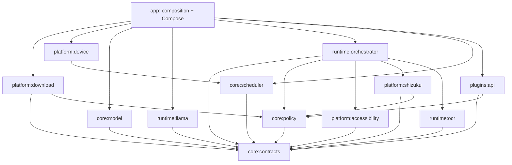

# LAI and NpuHub architecture comparison

Reviewed: 2026-08-16  
NpuHub tree reviewed at `feed05023fc3d670a5c8ccafbf04fddecf5fade2` through the authenticated GitHub API. No private source or screenshots were copied into LAI.

## Executive conclusion

NpuHub had the stronger general engineering backbone before this refactor: explicit core/backend/feature modules, extensive pure-JVM tests, module coverage floors, evidence-aware scheduling, reviewed artifact contracts, and source-level runtime-boundary checks. LAI had the stronger product/runtime implementation: real llama.cpp Android integration, Accessibility automation, Shizuku UserService control, a small nontechnical UX, strict no-binary Git policy, and physical Snapdragon 8s Gen 4 evidence.

The right global product is not either repository unchanged. LAI adopts NpuHub's strongest structural patterns while preserving LAI's automation authority boundaries and real native runtime.

## Capability comparison before LAI modularization

| Area | NpuHub | LAI | Decision |
|---|---|---|---|
| Module isolation | Strong: core/backend/features/plugins | Weak: one application module | Adopt layered multi-module graph in LAI |
| Pure-JVM logic/tests | Extensive with coverage ratchets | A few app unit tests | Extract contracts/policy/scheduler and enforce coverage |
| Runtime boundary checks | Static script blocks direct vendor/native imports | Native code correctly wrapped but not mechanically enforced | Add LAI-specific network/Accessibility/Shizuku/JNI boundary checker |
| Artifact trust | Reviewed catalog, digest/size state machine | Optional SHA and HF host validation | Make SHA mandatory and centralize local-first network policy |
| Scheduler | Evidence, thermal, battery, deterministic routing | Direct CPU backend choice | Add evidence-aware scheduler before Vulkan/QNN |
| Plugins | Small manifest/validation API | Documented seam only | Add versioned local-only plugin API; no dynamic loading yet |
| Native LLM | LiteRT/text-generation contracts and pinned demos | Real arm64 llama.cpp GGUF runtime | Keep LAI runtime; place it in isolated adapter module |
| Android automation | No Accessibility/Shizuku product runtime found | Working Accessibility and Shizuku UID 2000 | Keep and isolate as platform authority modules |
| OCR/RAG depth | Substantial reviewed OCR/RAG contracts | OCR placeholder | Reuse architectural lessons, not unverified capability claims |
| Product UX | Engineering hub with several large feature screens | Simple Chat/Reader/Automator product | Preserve LAI's consumer surface; split features only when needed |
| Source-only constraint | Commits wrapper JAR and tiny model fixture | Rejects wrapper, SDKs, models and binaries | Keep LAI's stricter repository policy |
| Device evidence | Detailed validation framework | Actual Redmi Turbo 4 Pro Phase 1 evidence | Combine evidence vocabulary and physical test reports |

## NpuHub patterns deliberately adopted

1. Pure contracts and policies independent of Android.
2. Adapter modules as the only owners of vendor/JNI APIs.
3. Capability evidence that distinguishes compiled, runtime-probed, device-validated and benchmarked.
4. Thermal, battery and memory-aware backend routing.
5. Per-module test coverage floors as ratchets rather than vanity targets.
6. Digest-pinned explicit model installation.
7. Static architecture checks that run before Android tooling.
8. A small versioned plugin contract with manifest/schema validation.

## Patterns deliberately not copied unchanged

- Twenty-five modules immediately would slow iteration and obscure the product. LAI starts with thirteen cohesive modules and splits feature UI when ownership warrants it.
- NpuHub's plugin interface validates input but does not provide a full capability-scoped execution lifecycle. LAI's API includes a constrained execution context, while dynamic third-party loading remains disabled.
- Large single-screen Compose files are not a target architecture. LAI will add feature modules plus state/route separation as each surface grows.
- A committed Gradle wrapper JAR conflicts with LAI's source-only rule. CI obtains Gradle remotely.
- Demo-model capability is not equivalent to production multilingual quality. LAI requires Bangla device evaluation before claiming readiness.

## New LAI dependency graph

Core modules cannot import Android. Network transport and `INTERNET` permission belong only to `platform:download`; Accessibility APIs only to `platform:accessibility`; Shizuku APIs only to `platform:shizuku`; JNI declarations and native loading only to runtime adapters. CI checks these invariants textually before downloading the Android toolchain.

## Global-product implications

This backbone supports future RAG, voice, vision, OCR, automation recipes and hardware adapters without allowing a feature to silently gain network, Accessibility, Shizuku or JNI authority. The application remains local-first by architecture rather than by a UI promise.
