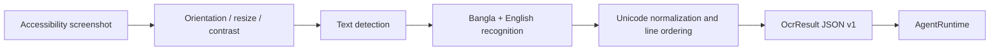

# Bangla OCR subsystem

## Current contract

Phase 1 provides the complete capture-to-engine boundary but no weight file. `PlaceholderBanglaOcrEngine` returns `OcrModelRequiredException`, which the UI and tool interface report honestly.

`OcrResult` schema version 1:

```json
{
  "schemaVersion": 1,
  "fullText": "বাংলা লেখা",
  "blocks": [
    {
      "text": "বাংলা লেখা",
      "language": "bn",
      "confidence": 0.97,
      "polygon": [{"x": 10, "y": 20}, {"x": 200, "y": 20}],
      "handwritten": false
    }
  ],
  "processingTimeMs": 42,
  "engine": "engine-id"
}
```

## Pipeline design



A plugin implements `OcrEngine` and receives an Android `Bitmap` plus language hints. Bitmap ownership remains with the caller and is recycled after completion.

## Model selection gates

A model is accepted only after:

- printed Bangla benchmark with varied fonts, sizes, screenshots, and low contrast;
- handwriting benchmark with independent writers;
- conjuncts, কার/ফলা, diacritics, numerals, punctuation, and mixed English coverage;
- line/reading-order evaluation;
- latency and peak RSS on the target phone;
- quantized accuracy regression comparison;
- redistributable model/runtime license;
- offline operation and no analytics dependency.

Report character error rate (CER), word error rate (WER), detection F1, end-to-end latency percentiles, peak memory, and thermal state. Printed and handwritten scores must be separate.

## Privacy

- no screenshot is persisted by default;
- no network permission is used by the OCR interface;
- password accessibility node text is omitted independently of OCR;
- secure/DRM surfaces may deny screenshots and must remain denied;
- future debug capture export requires explicit per-capture consent and redaction guidance.

## Planned adapters

1. TFLite baseline for broad device compatibility.
2. QNN-quantized detector/recognizer for Hexagon HTP.
3. optional handwriting-specific recognizer selected by classifier or user mode.

The same JSON schema allows backend comparison without changing agent tools.
