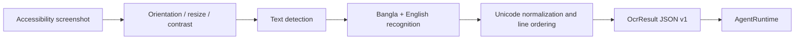

# Bangla OCR subsystem

## Current contract

The screen capture → `BanglaOcrService` → `OcrResult` tool path now uses Tesseract4Android 4.9.0 with offline Bengali and English `tessdata_fast` models. This is a real printed-text OCR implementation. The GitHub build fetches the model files at pinned source commit `87416418657359cb625c412a48b6e1d6d41c29bd`, verifies SHA-256, and packages them as Android assets. At first use, LAI verifies and copies the models into app-private storage; screenshots are never written to disk. No network access is needed at runtime.

The selected runtime and both models are Apache-2.0 licensed. The Bengali model SHA-256 is `31163084c279aaebd376216f0c3d5c17ad4b5fee8db49dae79c20000b5de5964`; English is `7d4322bd2a7749724879683fc3912cb542f19906c83bcc1a52132556427170b2`. See [Tesseract4Android](https://github.com/adaptech-cz/Tesseract4Android/tree/4.9.0) and [tessdata_fast](https://github.com/tesseract-ocr/tessdata_fast/tree/87416418657359cb625c412a48b6e1d6d41c29bd).

Source and CI verification do not establish OCR accuracy. Printed Bangla, mixed English, reading order, latency and memory need owner-operated testing on the Redmi Turbo 4 Pro after manual APK handoff. Handwriting is not a validated capability and the result explicitly says so. The `OcrResult` line blocks include Tesseract's line bounds and confidence; in mixed-language mode their language remains null rather than making up per-line language detection.

`OcrResult` schema version 1:

```json
{
  "schemaVersion": 1,
  "fullText": "বাংলা লেখা",
  "blocks": [
    {
      "text": "বাংলা লেখা",
      "language": "bn",
      "confidence": 0.97,
      "polygon": [{"x": 10, "y": 20}, {"x": 200, "y": 20}],
      "handwritten": false
    }
  ],
  "processingTimeMs": 42,
  "engine": "engine-id"
}
```

## Pipeline design


```mermaid
flowchart LR
  S[Accessibility screenshot] --> P[Orientation / resize / contrast]
  P --> D[Text detection]
  D --> R[Bangla + English recognition]
  R --> N[Unicode normalization and line ordering]
  N --> J[OcrResult JSON v1]
  J --> A[AgentRuntime]
```

A plugin implements `OcrEngine` and receives an Android `Bitmap` plus language hints. Bitmap ownership remains with the caller and is recycled after completion.

## Model selection gates

A model is accepted only after:

- printed Bangla benchmark with varied fonts, sizes, screenshots, and low contrast;
- handwriting benchmark with independent writers;
- conjuncts, কার/ফলা, diacritics, numerals, punctuation, and mixed English coverage;
- line/reading-order evaluation;
- latency and peak RSS on the target phone;
- quantized accuracy regression comparison;
- redistributable model/runtime license;
- offline operation and no analytics dependency.

Report character error rate (CER), word error rate (WER), detection F1, end-to-end latency percentiles, peak memory, and thermal state. Printed and handwritten scores must be separate.

## Privacy

- no screenshot is persisted by default;
- no network permission is used by the OCR interface;
- password accessibility node text is omitted independently of OCR;
- secure/DRM surfaces may deny screenshots and must remain denied;
- future debug capture export requires explicit per-capture consent and redaction guidance.

## Future adapters

1. A measured TFLite alternative for broad device compatibility if it outperforms this baseline.
2. QNN-quantized detector/recognizer for Hexagon HTP.
3. optional handwriting-specific recognizer selected by classifier or user mode.

The same JSON schema allows backend comparison without changing agent tools.
