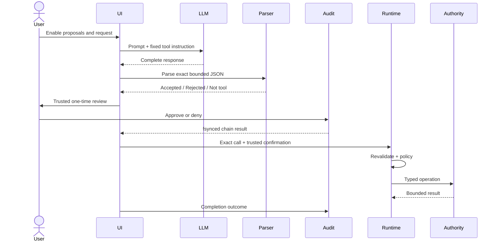

# Agent and automation architecture

Last audited: 2026-08-17

## Purpose

Describe the implemented one-shot, typed, consent-gated tool path and distinguish it from the planned multi-step agent, task center, diff, checkpoint, verification, and rollback systems.

## Responsibilities

- `core:contracts`: calls, results, errors, risk, audit, automation, and shell contracts.
- `core:policy`: canonical tool registry, exact parser/schema validation, consent decisions, replay ledger, shell argv compiler.
- `runtime:orchestrator`: second validation and dispatch to authority adapters.
- `platform:accessibility`: screen authority.
- `platform:shizuku`: elevated process authority.
- `platform:audit`: persistent content-free approval/completion chain.
- `app`: proposal opt-in, trusted review, approval/denial, and user-visible result.

## Current interfaces and tools

`ToolCall(id, name, arguments)` and `ToolResult` are the model-facing protocol. Built-ins are `screen.snapshot`, `screen.click`, `screen.type`, `screen.scroll`, `system.global_action`, `app.launch`, `ocr.current_screen`, and `shell.operation`. Each has an exact schema and canonical `ToolRisk`.

`AutomationCommand` permits bounded selectors and named actions. `PrivilegedCommand` contains a named operation plus validated fields; `ShellCommandPolicy` compiles an argv list. No raw shell-string API exists.

## Dependencies

`AgentRuntime` depends on pure policy plus Accessibility, Shizuku, and OCR adapters. The model never receives object references, Binder handles, node objects, confirmation state, or shell access. `MainViewModel` currently coordinates generation, proposal review, persistent audit, and execution.

## Current task lifecycle

This is one action maximum. Tool output is not fed back into the model, and there is no autonomous planning loop.

## Data flow

Model proposal bytes are bounded and parsed as untrusted input. Audit storage contains tool name, risk, call fingerprint, event/time/sequence/outcome, and record hashes—not arguments or outputs. Screen snapshots may be returned to trusted UI/runtime but screen content is data, not authority.

## Security boundaries

- Proposal mode is off by default.
- Exact whole-response JSON and per-tool schemas reject mixed prose, unknown keys, and model-authored confirmation.
- Consequential tools require trusted per-action approval.
- Approval is persisted and fsynced before authority.
- Exact approved call fingerprints cannot be replayed.
- Password text is omitted; sensitive typing is disabled for model tools.
- Shizuku policy never invokes `sh -c`.
- Audit corruption disables proposals.

## Failure and recovery behavior

Parser/policy/authority failures become typed results. Denial invokes no authority. Audit-approval failure prevents execution and disables proposal mode. Completion-audit failure disables further proposals but cannot undo an already executed operation. There is no user-facing audit reset/archive, crash-resume task state, compensation plan, or rollback engine.

## Testing strategy

Pure tests cover parser schemas, consent, audit transitions/replay, shell argument policy, and automation contracts. Android audit file tests cover persistence/corruption. Physical tests are still required for selectors/actions, service death, foreground binding, restart/replay, and model exact-format compliance.

## Extension strategy

A multi-step runtime must add explicit `Goal → Plan → Step → Permission → Execution → Observation → Verification` contracts, maximum steps, budgets, deadlines, cancellation, retry policy, checkpoints, provenance, and task history. It must preserve typed tools and per-step authority. File/project mutation must be diff-first with explicit approval and rollback. These changes require ADRs and must not be grafted into the current one-shot parser without design review.

The task center, diff engine, rollback engine, project trust, and multi-step agent are **PLANNED/MISSING**, not current capabilities.

## Canonical related documents

- [`../AUTOMATION_TOOLS.md`](../AUTOMATION_TOOLS.md)
- [`../SECURITY_AND_SAFETY.md`](../SECURITY_AND_SAFETY.md)
- [`../adr/0006-one-shot-model-tool-proposals.md`](../adr/0006-one-shot-model-tool-proposals.md)
- [`../adr/0007-persistent-tool-audit-and-replay-guard.md`](../adr/0007-persistent-tool-audit-and-replay-guard.md)
