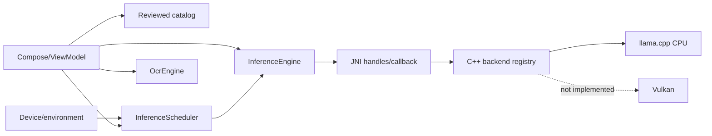

# AI architecture

Last audited: 2026-08-17

## Purpose

Document the implemented local inference/model architecture and clearly separate it from the target AI Gateway, localhost server, remote providers, RAG, and multimodal systems.

## Current responsibilities

- `core:contracts`: provider-neutral inference/model data types and `InferenceEngine`.
- `core:model`: one immutable reviewed Qwen artifact record.
- `core:scheduler`: resource/evidence-based backend selection.
- `platform:device`: runtime environment observations.
- `platform:download`: signed catalog and verified model lifecycle.
- `runtime:llama`: JNI/C++ llama.cpp implementation.
- `runtime:ocr`: OCR adapter seam; current engine is unavailable placeholder.
- `app`: explicit model install/load/generate/unload UX.

## Interfaces

```kotlin
interface InferenceEngine : AutoCloseable {
    val capabilities: RuntimeCapabilities
    val contextSize: Int
    suspend fun load(modelPath: String, backend: BackendId? = null): Result<Unit>
    fun generate(conversation: List<ConversationMessage>, config: GenerationConfig): Flow<InferenceEvent>
    suspend fun countTokens(conversation: List<ConversationMessage>): Result<Int>
}
```

`BackendId` is opaque and adapter-owned. `BackendDescriptor` reports compute class, formats, quantizations, and preference without embedding vendor decisions in core. `OcrEngine` is a separate interface to avoid forcing image dependencies into inference core.

## Dependencies

The app combines catalog metadata, `AndroidRuntimeEnvironmentProvider`, `InferenceScheduler`, `ModelMemoryEstimator`, and runtime capabilities before loading. `runtime:llama` depends only on core contracts; it does not depend on download, UI, scheduler, or Qualcomm APIs.

## Model lifecycle

1. User selects a signed-catalog model, manual reviewed-host URL plus digest, or local import.
2. Bytes stream to app-private staging.
3. SHA-256, optional exact size, and GGUF magic are verified.
4. Artifact is activated and entered in private registry.
5. User explicitly loads it after scheduler admission.
6. Native session streams UTF-8 token events and metrics.
7. User or memory-pressure handling closes the session.
8. “Keep copy” exports and re-verifies a user-owned artifact.

Model download/import now applies the expected artifact size—or available storage minus the safety reserve when length is unknown—as a pre-write stream ceiling, with an 8 GiB absolute cap. SAF workspace discovery still requires the same in-loop enforcement and deadline hardening; see current-state risks.

## Runtime data flow



Conversation content remains local. Metrics remain in memory and may enter explicit privacy-filtered diagnostics. Public catalog/model bytes are the only AI-related network flow.

## Security boundaries

- Signed catalog and embedded public key establish metadata integrity.
- HTTPS, purpose-specific host allowlist, SHA-256, size metadata, and GGUF magic protect artifacts.
- Unknown external workspace artifacts are `LOCAL_UNREVIEWED` and never auto-loaded.
- Native code is a memory-safety boundary and requires fuzzing/hardening.
- Model output is untrusted and gains no authority from inference.
- No silent cloud fallback exists.

## Failure behavior

No native library/backend/model yields typed failure. Scheduler rejects incompatible ABI/format/backend or unsafe memory/thermal/battery state. Invalid catalogs fall back to a verified cache or embedded catalog. OCR reports model required. Cancellation exists in the flow/JNI callback but still requires broader physical recovery validation.

## Testing strategy

Unit tests cover contracts, model catalog, scheduler, and memory estimator. CI compiles JNI/C++ against pinned llama.cpp. Physical evidence covers CPU load, local multi-turn generation, Bangla output, metrics, and retained-copy recovery on one named device. Vulkan, QNN, remote providers, server APIs, and broad quality/thermal claims remain untested because they are not implemented.

## Extension strategy and target boundaries

The target `AiGateway` is **PLANNED**, not an alias for `InferenceEngine`. Before implementation it needs approved provider, routing, context, permission, usage, and audit contracts. Potential providers are embedded, managed localhost, explicitly configured remote-local/LAN, and remote APIs. UI must depend on the gateway contract, not provider SDKs.

A managed localhost server is **MISSING**. Its design must precede code and cover loopback-only default, authentication, lifecycle, safe ports, streaming, health/models APIs, logs without content leakage, client visibility, limits, and kill switch. Vulkan and QNN require real isolated adapters and device evidence. RAG and multimodal capabilities remain separate future modules.

## Canonical related documents

- [`../MODELS_AND_BACKENDS.md`](../MODELS_AND_BACKENDS.md)
- [`../VENDOR_BACKEND_STRATEGY.md`](../VENDOR_BACKEND_STRATEGY.md)
- [`../BANGLA_OCR.md`](../BANGLA_OCR.md)
- [`../PRIVACY_INVARIANTS.md`](../PRIVACY_INVARIANTS.md)
