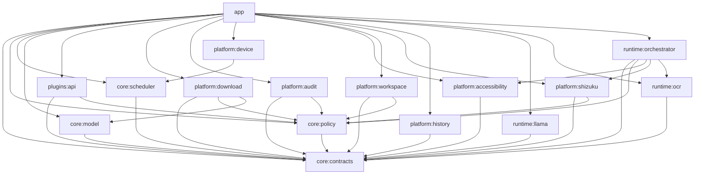

# Module map and dependency graph

Last audited: 2026-08-21 · **16 Gradle modules**

## Purpose

This is the source-verified module inventory and compile-time dependency map. It complements [`../MODULES.md`](../MODULES.md), which remains the concise ownership policy.

## Audited module inventory

| Module | Type | Main responsibility | Direct project dependencies | Test evidence |
|---|---|---|---|---|
| `:core:contracts` | Kotlin/JVM | Tool, audit, automation, inference, OCR, settings, shell, diagnostics, workspace contracts | none | 10 test files |
| `:core:policy` | Kotlin/JVM | Agent consent/parser, audit ledger, zero-egress policy, shell compiler, settings/workspace policy | `core:contracts` | 7 test files |
| `:core:scheduler` | Kotlin/JVM | Device/backend evidence, resource admission, memory estimates | `core:contracts` | 2 test files |
| `:core:model` | Kotlin/JVM | Embedded reviewed model catalog | `core:contracts` (API) | 1 test file |
| `:plugins:api` | Kotlin/JVM | Local-only plugin manifest and execution contract | `core:contracts`, `core:policy` (API) | 1 test file |
| `:platform:download` | Android library | Sole HTTP transport, signed catalog, model import/export/registry | contracts, policy, model | no direct test file |
| `:platform:audit` | Android library | No-backup JSONL audit persistence and fsync | contracts (API), policy | 1 test file |
| `:platform:device` | Android library | Android/SoC/memory/battery/thermal observations | scheduler (API) | no direct test file |
| `:platform:accessibility` | Android library | Accessibility service, snapshots, actions, screenshot | contracts | no direct test file |
| `:platform:workspace` | Android library | SAF grant/layout, settings store, discovery | contracts (API), policy | 1 test file |
| `:platform:shizuku` | Android library | Shizuku state, UserService, elevated argv execution | contracts, policy | no direct test file |
| `:platform:history` | Android library | Local chat-history persistence and repository contract | `core:contracts` | history tests present |
| `:runtime:llama` | Android/native library | `InferenceEngine`, JNI, C++ backend registry, llama CPU and optional accelerator integration | contracts (API) | compiled in CI; native integration evidence tracked separately |
| `:runtime:ocr` | Android library | `OcrEngine` seam and honest placeholder | contracts (API) | no direct test file |
| `:runtime:orchestrator` | Android library | Policy-gated typed tool dispatch | contracts (API), policy, Accessibility, Shizuku, OCR | no direct test file |
| `:app` | Android application | Composition, lifecycle, Compose, `MainViewModel` | all modules | app-level tests present for selected coordinators |

## Dependency graph

## Interfaces and ownership

Core owns types, not authority. Android authority belongs only to platform modules. Runtime owns replaceable computation. The app creates concrete objects in `AppContainer`; no service locator is exposed to plugins or model output.

## Accelerator boundary

GPU/NPU implementations remain inside `:runtime:llama` (native/runtime boundary) and must not leak Qualcomm/vendor types into `core`. Device evidence is consumed as backend qualification state, not as a reason to bypass architecture boundaries.

For the current Redmi Turbo 4 Pro investigation:

- `/dev/kgsl-3d0` access from the LAI app identity is **AVAILABLE** evidence;
- Qualcomm OpenCL library presence is **AVAILABLE** evidence;
- Vulkan model loading is **AVAILABLE**, but generation remains unvalidated because of the Qualcomm driver crash;
- no accelerator is `DEVICE_VALIDATED` until real model execution succeeds with reproducible evidence.

## Lifecycle

Android components are application/activity/Accessibility service/Shizuku provider/UserService. Native llama sessions are handle-based and explicitly destroyed. Repositories live for the application container lifetime. Workspace access exists only while a persisted SAF grant remains valid.

## Data flow and authority flow

- Network: app → download repositories → HTTPS reviewed endpoints.
- Inference: app → `InferenceEngine` → JNI → C++ backend → llama.cpp / optional accelerator path.
- Automation: app → `AgentRuntime` → policy → Accessibility/Shizuku.
- Audit: app → `ToolAuditRepository` → no-backup private file.
- Workspace: app → SAF repository/store/discovery (settings via `AtomicNamedDocumentReplace`).
- Chat content: app → `platform:history` only.

## Security and failure boundaries

Architecture checks reject forbidden module direction, misplaced network/Android/JNI/vendor terms, and source artifacts. Module absence or adapter failure must surface as unavailable; modules must not silently borrow another module’s authority.

## Testing strategy

Unit-test pure decisions in core; use Android fake/provider tests for platform persistence; JNI/native integration in CI; instrumentation and physical tests for authority and device behavior. Accelerator qualification requires target-device evidence in addition to build success.

## Extension rules

- New authority → new or explicitly extended platform owner.
- New inference backend → isolated runtime/native adapter implementing core contracts.
- New provider/gateway abstractions → pure contracts first, concrete adapters second.
- New product surfaces → feature modules only when state/navigation boundaries are designed.
- No module is added merely to claim roadmap progress.
