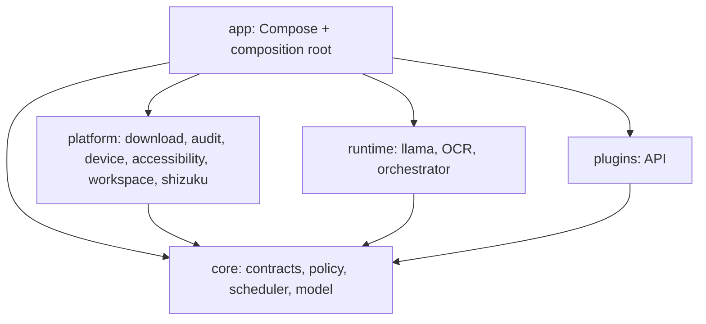

# LAI architecture overview

Last audited: 2026-08-17 · Source baseline: `c53ec20`

## Purpose

LAI is one Android application for private, Bangla-first, on-device inference and consent-gated Android automation. The architecture separates pure contracts and decisions from Android authority, native inference, orchestration, and UI composition. This document is an audited overview; detailed existing design remains in [`../ARCHITECTURE.md`](../ARCHITECTURE.md), [`../MODULES.md`](../MODULES.md), and the accepted ADRs in [`../adr/`](../adr/).

## Responsibilities and layers

- **Core:** serializable contracts and pure decisions; no Android authority, transport, JNI, or vendor SDK.
- **Platform:** narrowly owned Android capabilities and persistence boundaries.
- **Runtime:** replaceable inference/OCR/orchestration implementations.
- **Plugins:** versioned local-only contract, not a plugin loader or manager.
- **App:** sole composition root, lifecycle owner, and Compose product shell.

## Principal interfaces

- `InferenceEngine` — load, token count, streamed generation, capabilities, close.
- `OcrEngine` — bitmap recognition behind a replaceable adapter.
- `ToolCall` / `ToolResult` / `ToolDefinition` — typed agent protocol.
- `AutomationCommand` — bounded Accessibility operations.
- `PrivilegedCommand` — named elevated operation, never raw shell.
- `WorkspaceSettingsCodec` / workspace contracts — bounded external configuration and discovery decisions.
- `LaiPlugin` — local-only plugin API v1 contract.

## Dependencies

Compile-time direction is inward toward `core`. `app` may compose all reviewed public APIs. Platform modules cannot depend on app or runtime; runtime modules implement core contracts; only `platform:download` owns network transport. The exact audited graph is in [`module-map.md`](module-map.md).

## Runtime lifecycle

1. `LaiApplication` creates `AppContainer`.
2. `AppContainer` composes repositories, policies, runtime adapters, scheduler, and authority gateways.
3. `MainViewModel` observes Accessibility/Shizuku state and coordinates product operations.
4. Models are explicitly downloaded/imported, verified, then explicitly loaded.
5. Inference streams local events; optional tool proposals are parsed only after generation completes.
6. A trusted UI review and durable audit approval precede consequential tool execution.
7. Native sessions close on explicit unload, ViewModel teardown, or critical memory pressure.

## Data flow

Prompts and generations flow from Compose to `InferenceEngine` and remain local. Public catalog/model bytes may flow inbound only through `platform:download`. Screen data flows from Accessibility to bounded immutable structures or in-memory bitmaps. Tool audit records contain fingerprints and outcomes, not arguments or output content. User-owned workspace access uses an explicitly granted SAF tree.

## Security boundaries

The trust boundaries are model output, screen content, downloaded artifacts, SAF documents, Accessibility authority, Shizuku authority, plugin input, native code, and CI secrets. Policy is fail-closed: unavailable authority or failed validation produces a typed failure, not a broader fallback. See [`security-architecture.md`](security-architecture.md).

## Failure behavior

- Missing model/backend: inference load/generation fails visibly.
- Missing Accessibility/Shizuku: corresponding tool is denied.
- Invalid model proposal: rejected before authority.
- Corrupt audit: proposal mode disabled.
- Invalid model/catalog/workspace data: rejected or safe defaults used.
- Missing OCR model: explicit model-required error.

## Testing strategy

Pure contracts, policy, scheduler, catalog, plugin manifest, audit, and format detection have unit tests. CI runs source boundaries, coverage ratchets, Android unit tests, lint, native build, and APK assembly. Physical evidence currently covers the Qwen CPU baseline and selected app flows on Redmi Turbo 4 Pro; it does not establish production readiness.

## Extension strategy

Add new behavior behind core contracts and isolated adapters. A second inference provider should precede a generic provider manager. New Android authority requires a dedicated platform owner, explicit permission/policy, tests, documentation, and an ADR. Roadmap systems such as AI Gateway, localhost server, project/workstation, RAG, and plugin management are not present and must not be inferred from these seams.

## Current architectural constraints

- `MainViewModel` is a large orchestration surface and needs decomposition before workstation-scale UI.
- Only llama CPU is real; Vulkan and QNN are not implemented.
- Agent execution is one-shot, not a multi-step autonomous loop.
- Plugin API exists, but discovery, installation, sandboxing, and lifecycle management do not.
- No AI Gateway, localhost inference server, remote provider, project system, diff/rollback engine, terminal, Git workbench, or Linux runtime exists.
