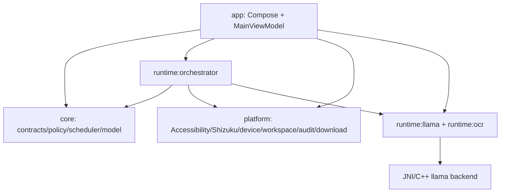

# LAI system architecture

Last audited: 2026-08-17 · Source baseline: `c53ec20`

## Purpose

This directive-required document gives the end-to-end system view. It complements the detailed diagrams in [`../ARCHITECTURE.md`](../ARCHITECTURE.md), the audited overview in [`overview.md`](overview.md), and the exact Gradle graph in [`module-map.md`](module-map.md).

## Responsibilities

- `app` owns composition, lifecycle, trusted confirmation UI, and user-visible state.
- `core` owns serializable contracts and pure decisions without Android/JNI/network authority.
- `platform` owns narrow Android authority, storage, environment, audit, and the only network transport.
- `runtime` implements replaceable computation and typed orchestration.
- `plugins:api` defines a local-only contract but no loader/manager.

## Interfaces

Primary boundaries are `InferenceEngine`, `BackendDescriptor`, `OcrEngine`, `ToolCall`/`ToolResult`, `AutomationCommand`, `PrivilegedCommand`, `WorkspaceSettingsCodec`, and `LaiPlugin`. Concrete implementations are composed only by `AppContainer`.

## Dependencies

Compile-time dependencies point inward toward core. Platform does not depend on app/runtime; inference runtimes do not own UI or transport; only `platform:download` has network permission. The exact direct dependencies are listed in [`module-map.md`](module-map.md) and enforced by `scripts/check_architecture_boundaries.py`.

## Lifecycle

`LaiApplication` creates one `AppContainer`; `MainActivity` hosts Compose; `MainViewModel` observes app-lifetime repositories and authority state. Accessibility and Shizuku have independent Android lifecycles. Models are installed then explicitly loaded. Native sessions are handle-based and closed on unload, teardown, or critical memory pressure. Workspace authority exists only while a persisted SAF grant is valid.

## Data flow

- Public catalog/model bytes: explicit user action → `platform:download` → verified private storage.
- Prompt/generation: Compose → ViewModel → local `InferenceEngine` → JNI/C++ → streamed local events.
- Tool proposal: model text → strict parser → trusted review → fsynced audit → typed authority → bounded result.
- Screen/OCR: Accessibility → bounded snapshot/in-memory bitmap → OCR adapter; bitmap recycled.
- Workspace: explicit SAF tree → bounded settings/discovery; registration never auto-loads a model.

No user-derived outbound flow is authorized in the current system.

## Security boundaries

Untrusted inputs are model output, visible screen content, downloads, SAF documents, future plugin packages, and native data. High authority resides in Accessibility and Shizuku and is disabled/unavailable without user action. Approval cannot originate in model JSON. Shell operations compile to validated argv and never use `sh -c`. Catalog signatures, artifact hashes, format checks, audit chaining, and architecture gates protect other boundaries.

## Failure behavior

Unavailable adapters fail visibly; no fake output or cloud fallback is substituted. Invalid artifacts are not activated. Corrupt audit disables model proposals. Missing/revoked permissions deny tools. OCR without a real model reports unavailable. Invalid settings use safe defaults. Native/session errors become typed inference failures.

## Testing strategy

Pure rules use JVM unit/property/fuzz tests; Android storage/authority uses fake-provider, Robolectric/instrumentation, and physical tests; JNI/C++ is compiled in CI and needs lifecycle/sanitizer/fuzz coverage; hardware claims require named-device evidence. See [`../implementation/testing-plan.md`](../implementation/testing-plan.md).

## Extension strategy

New authority receives a reviewed platform owner and policy. New compute receives an isolated runtime adapter. AI Gateway, localhost server, multi-step agent, Project/workstation, Linux, RAG, Plugin Manager, studios, and remote systems require their phase documentation and ADRs before code. Existing CPU inference and one-shot tool paths remain regression fallbacks during migration.

## Current limitations

The application is still one Android process for most presentation/runtime coordination; the directive’s “not monolithic” rule is currently achieved mainly through compile-time modules and isolated Android/native authorities, not a completed multi-process platform. `MainViewModel` is oversized. Only CPU inference is real. No Gateway/server/project/workstation/multi-step task runtime exists.
